# TallerLambda
1. Creamos una nueva clase para este taller

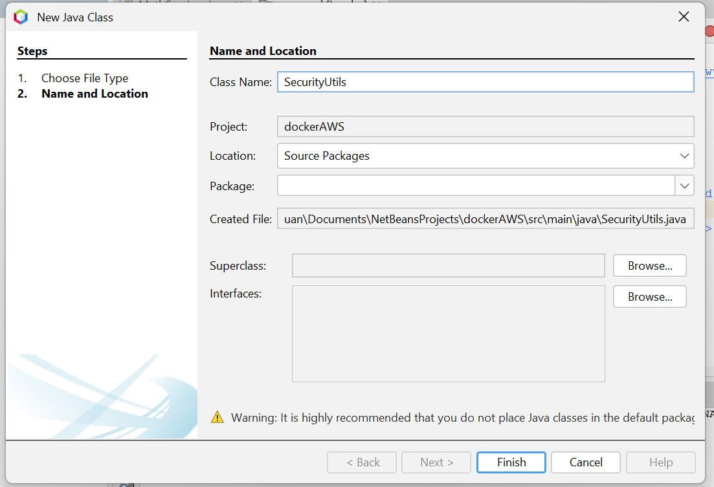

2. Le creamos un metodo de prueba, que en este caso es el de login

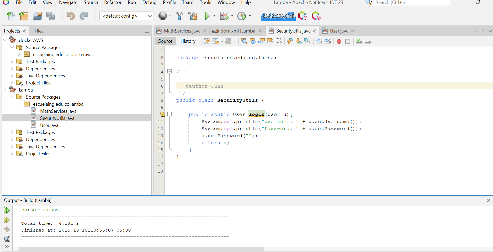

3. En Aws creamos la funcion Lambda

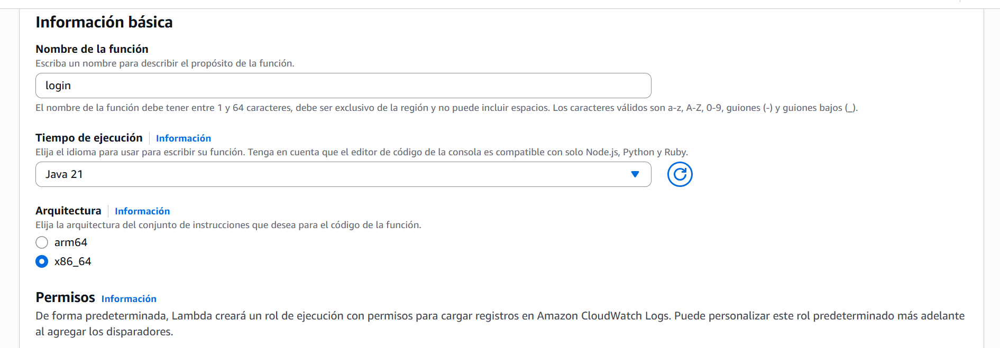

4. Una vez creada la funcion lamda subimos el archivo .jar

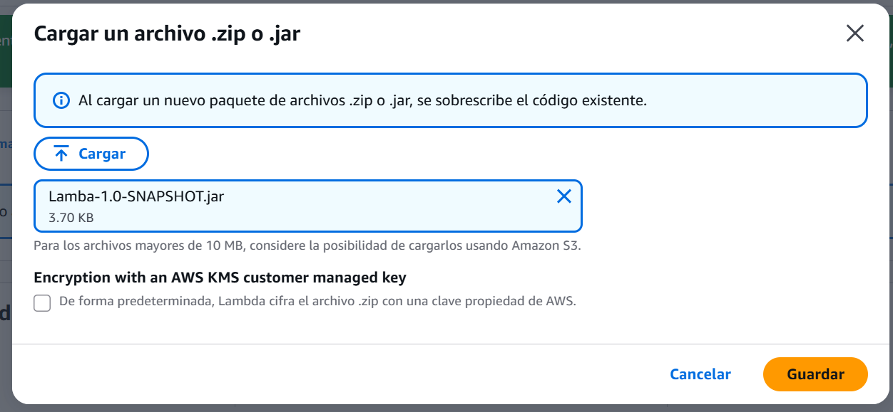

5. cambiamos el controller, para que sepa a que meto debe de dirigirse, como vemos en la imagen, va dirigido a la clase de SecurityUtils y va al metodo login

6. una vez hecho hacemos una prubea en la mismo apartado de Lambda

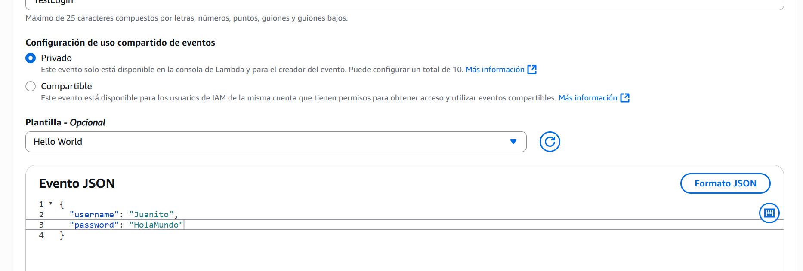

7. Podemos ver que si esta correcto la prueba por dos cosas, la primera arroga un stado 200 y retorna la contraseña vacia porque asi la pusimos 

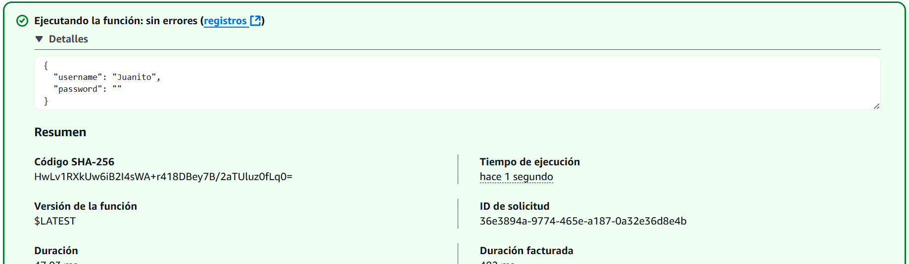

8. ahora vamos a crear el apiGateway, pero usamos el que ya tenemos de esta misma clase, por lo que debemos de crear el recurso

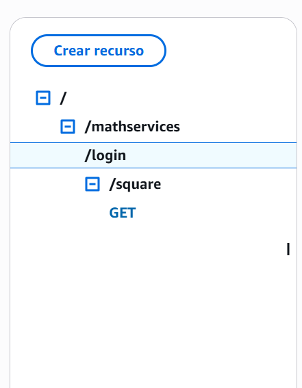

9. creamos un metodo Get para poder probar

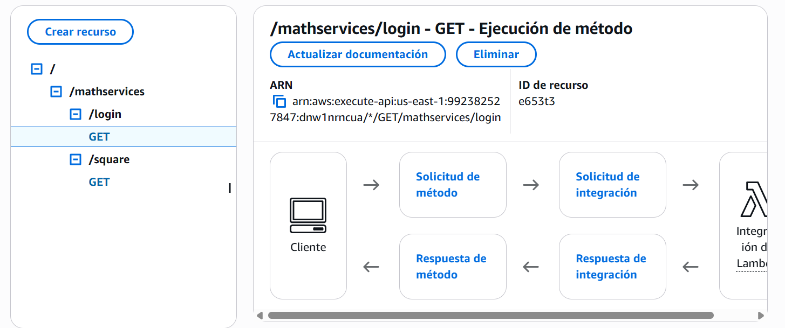

10. Le añadimos los parametros de "username" y "password"

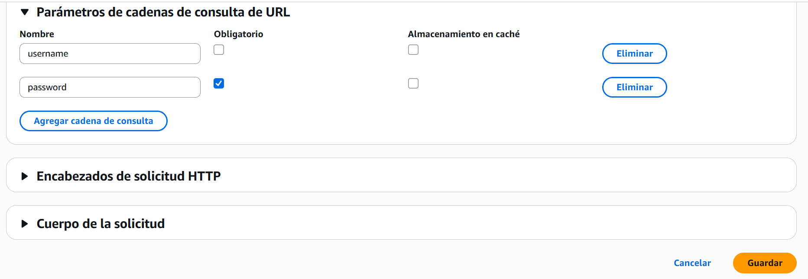

11. en la plantilla de asignacion, osea el formato JSON, tambien debemos de poner las variables que pusimos anteriormente
 
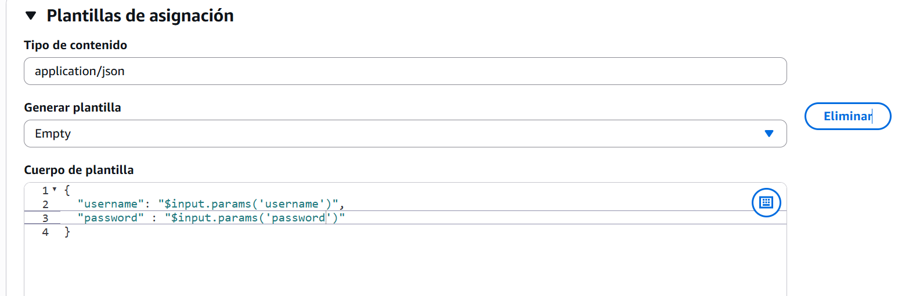

12. Hacemos la prueba en el apiGateway y podemos observar que si funciona

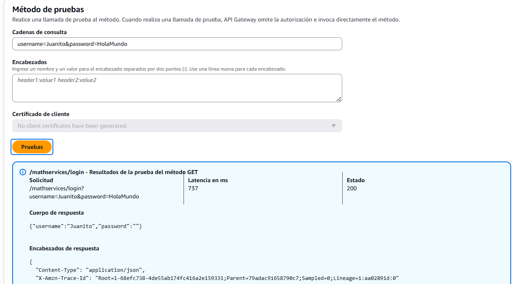

